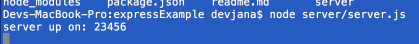
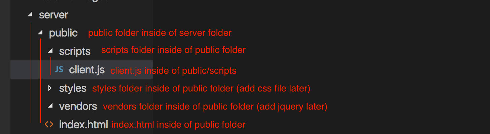
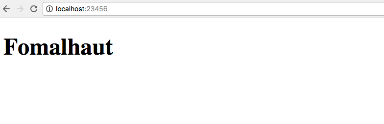
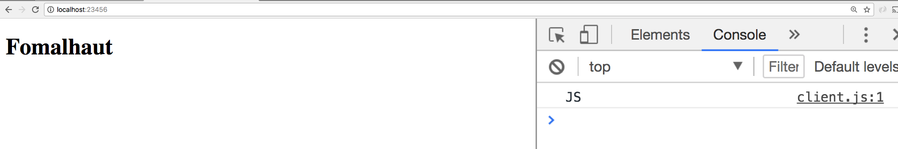
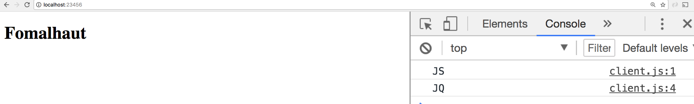
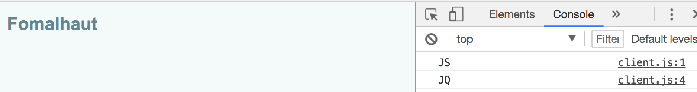

Fomalhaut Express Intro
===

- git init
- npm init
 - can't use spaces or cap letters in name
 - creates package.json
- create 'server' folder in the root
- create 'server.js' in server folder
- back on terminal run ```npm install express --save```
- check package.json for dependencies
- create .gitignore
- make sure 'node_modules' is ignored

in server.js:

- add the following code:

```
const express = require( 'express' );
const app = express();
const port = 23456;

app.listen( port, function(){
    console.log( 'server up on:', port );
}); 
```
- this creates an exprss app and tells it to listen on the given port
- back in terminal run the following:

```node server/server.js```

- this should spin up a server on the given port and console log out a message in your terminal



- use "ctrl+c" to stop the server
- NOTE: client-side console logs show up in the browser, server-side console logs appear in the terminal

- add "start" script to your package.json:

```
  "scripts": {
    "test": "echo \"Error: no test specified\" && exit 1",
    "start": "node server/server.js"
  },
```
- setup folder structure



- update HTML file
- in server.js, add the following above the app.listen:

```
app.use( express.static( 'server/public' ) );
```

- you should now be able to lead the following url in the browser:



- add a console log to client.js file:
```
console.log( 'JS' );
```
- src in the client.js file
```
<script src="scripts/client.js"></script>
```
- reload the browser:


- move jquery into the server/vendors folder
- src in html
```
<script src="vendors/jquery-3.2.1.min.js"></script>
```
- add a make sure it works with a tiny bit of JQ:
```
$( document ).ready( function(){
    console.log( 'JQ' );
});
```
- reload browser


- create a css file (nothing fancy) in server/styles
- link in html
```
<link rel="stylesheet" href="styles/beach.css">
```
- reload browser



